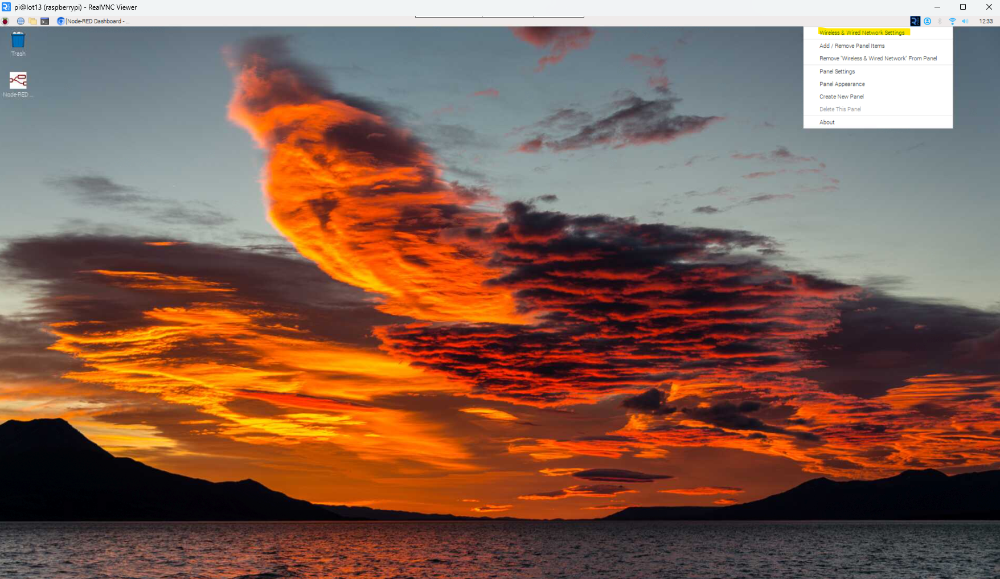
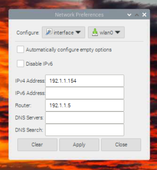

# Setting Up Raspberry Pi

**This tutorial covers how to connect Raspberry Pi to Laptop wirelessly. Share your Raspberry Pi screen on laptop screen and control it with laptop mouse and keyboard.**

**You can find the Tutorial posted [here.](https://github.com/samvidita/Connect-RaspberryPi-to-laptop-wirelessly?tab=readme-ov-file#connect-raspberry-pi-to-laptop-wirelessly)**

Step 1: Setup Raspberry Pi with a fixed IP Address for remote access. 

Step 2: Set the fix IP Address for the Raspberry Pi

# Install MariaDB and PHPMyAdmin on Raspberry Pi 

**You can find the Tutorial posted [here](https://raspberrytips.com/install-mariadb-raspberry-pi) or [here.](https://pimylifeup.com/raspberry-pi-mysql)**

# Install HIDdevice module in Node Red 

**You can find the Tutorial posted [here](https://flows.nodered.org/node/@gdziuba/node-red-usbhid) and [here.](https://github.com/node-hid/node-hid#linux-notes)**

> _Note : HIDdevice is for connecting the RFID scanner to Node Red
