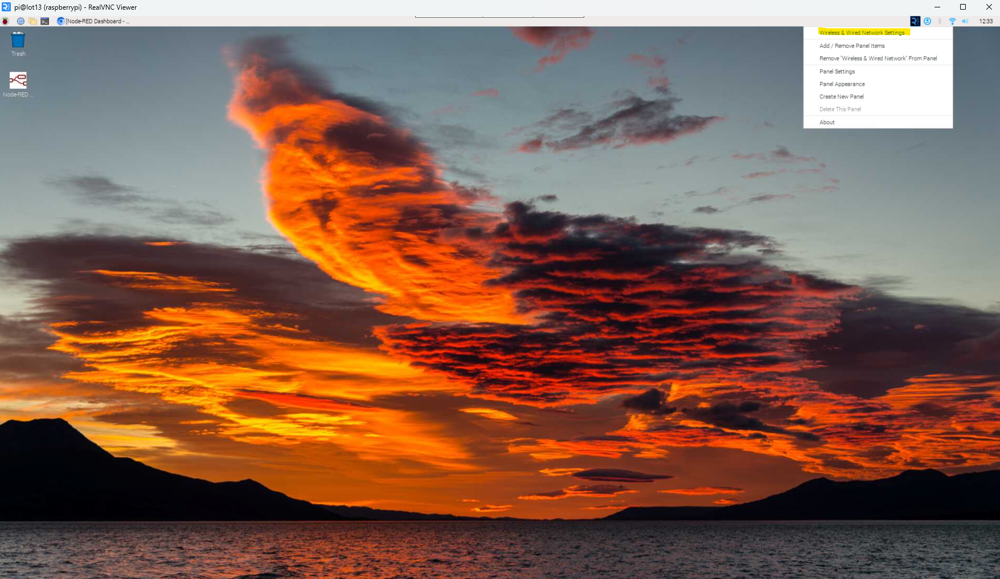
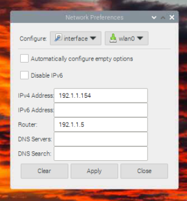

# Setting Up Raspberry Pi

**This tutorial covers how to connect Raspberry Pi to Laptop wirelessly. Share your Raspberry Pi screen on laptop screen and control it with laptop mouse and keyboard.**

**You can find the Tutorial posted [here.](https://github.com/samvidita/Connect-RaspberryPi-to-laptop-wirelessly?tab=readme-ov-file#connect-raspberry-pi-to-laptop-wirelessly)**

Step 1: Setup Raspberry Pi with a fixed IP Address for remote access. 

Step 2: Set the fix IP Address for the Raspberry Pi

# Install MariaDB and PHPMyAdmin on Raspberry Pi 

**You can find the Tutorial posted [here](https://raspberrytips.com/install-mariadb-raspberry-pi) or [here.](https://pimylifeup.com/raspberry-pi-mysql)**

**Allow mariadb to be connected from any IP-address.**

Step 1: 

    sudo nano /etc/mysql/mariadb.conf.d/50-server.cnf

Step 2:

    bind-address = 0.0.0.0

Step 3: 

    sudo systemctl restart mariadb

# Install Node-Red 

Step 1: 

    bash <(curl -sL https://github.com/node-red/linux-installers/releases/latest/download/update-nodejs-and-nodered-deb)

Step 2: 

    sudo systemctl enable nodered.service

Step 3: 

    node-red-start

# Install HIDdevice module in Node-Red 

Prerequisite: sudo apt install libusb-1.0-0 libusb-1.0-0-dev libudev-dev

**You can find the Tutorial posted [here](https://flows.nodered.org/node/@gdziuba/node-red-usbhid) and [here.](https://github.com/node-hid/node-hid#linux-notes)**

> _Note : HIDdevice is for connecting the RFID scanner to Node-Red. 

# Set the Admin password in Node-Red 

**You can find the Tutorial posted [here](https://discourse.nodered.org/t/password-in-node-red/50288/43?page=3) or [here.](https://discourse.nodered.org/t/node-red-security-password/10774/4)**

> _Note : node-red admin hash-pw

# Set Chromium Browser to Launch on Boot 

The easiest way to launch an application on boot is to modify the autostart file, which is used to configure applications that run when the desktop environment starts.

Step 1: Open a terminal on your Raspberry Pi.

Step 2: Create an autostart directory if it doesn’t exist

    sudo mkdir -p ~/.config/autostart

Step 3: Create a new autostart file for Chromium

    sudo nano ~/.config/autostart/chromium-browser.desktop

Step 4: Add the following content to the file

    [Desktop Entry]
    Type=Application
    Name=Chromium Browser
    Exec=chromium-browser --kiosk --start-fullscreen https://www.example.com
    X-GNOME-Autostart-enabled=true

The Exec line uses --kiosk mode to launch Chromium in full-screen without any toolbars or controls.

You can replace `https://www.example.com` with the website or local file you want to open. Remove --start-fullscreen if you don’t want it in full screen.

Replace https://www.example.com with the URL or local file path you want Chromium to load.

The X-GNOME-Autostart-enabled=true ensures the application starts on boot.

Step 5: After making the changes, reboot your Raspberry Pi to see the browser launch on startup:

    sudo reboot
